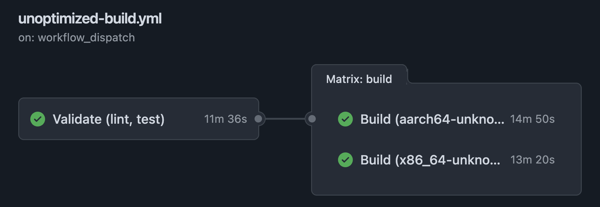
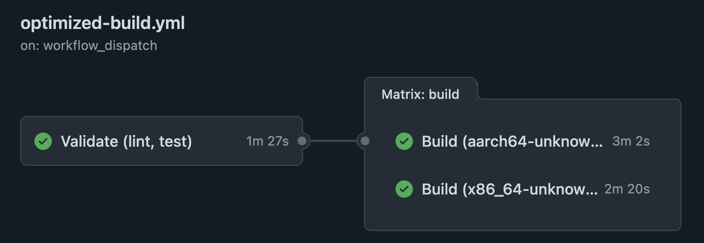
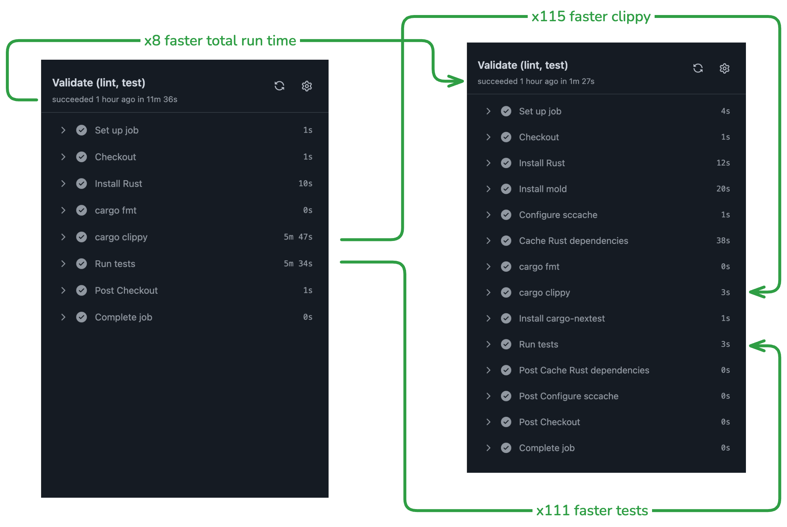

Compiling Rust is slow out of the box.
This becomes a problem in CI.
One small change can kick off a 15+ minute CI job.
This is not ideal from a cost or developer experience perspective.
In this post I take a real workflow from roughly `26 minutes` down to `under 5 minutes`
and walk through each optimization.

## Why Rust Behaves This Way

There are three areas that cause Rust to compile slowly:

1. Dependency Compilation
2. Project Compilation
3. Linking

Build times are particularly painful in Rust because it relies heavily on monomorphization.
That sounds like a big scary word, but it isn't.
It means every time there is some generic type used in your Rust code, the compiler generates implementations
for each concrete type.

...ok, maybe that is kind of advanced. If you don't understand what that means, don't worry about it; know that
this is a lot of work, and you want to avoid it when you can.

Cargo's default local caching behavior lets you avoid it when building locally. 

In contrast, when a GitHub Actions runner starts, it is a clean slate.
It downloads everything and does all three steps every time.

### An Unoptimized CI Job

An unoptimized GitHub Actions workflow might look like this.
The comments label six baseline behaviors.
Each one gets addressed in the next section.

```yaml
name: Unoptimized Rust CI

permissions:
  contents: read

on:
  push:
    branches:
      - main
  pull_request:
  workflow_dispatch:

jobs:
  validate:
    name: Validate (lint, test)
    runs-on: ubuntu-latest

    # Baseline #1 (Linker): no RUSTFLAGS override, so every link
    # step uses the default GNU ld.
    # Baseline #2 (Compiler Cache): no sccache, so every compilation
    # unit is rebuilt from scratch on every run.
    # Baseline #3 (Dependency Cache): no cache action, so all
    # dependencies are recompiled on every run.
    steps:
      - name: Checkout
        uses: actions/checkout@v6

      - name: Install Rust
        uses: dtolnay/rust-toolchain@stable

      - name: cargo fmt
        run: cargo fmt -- --check

      - name: cargo clippy
        run: cargo clippy --locked --all-targets --all-features -- -D warnings

      # Baseline #4 (Test Runner): plain `cargo test`, which runs test
      # binaries with less parallelism than nextest.
      - name: Run tests
        run: cargo test --locked --all-features

  build:
    name: Build (${{ matrix.target }})
    runs-on: ubuntu-latest
    needs: [ validate ]
    strategy:
      fail-fast: false
      matrix:
        target:
          - x86_64-unknown-linux-musl
          - aarch64-unknown-linux-musl

    steps:
      - name: Checkout
        uses: actions/checkout@v6

      - name: Install Rust
        uses: dtolnay/rust-toolchain@stable

      # Baseline #5 (Cross Compilation): `cargo install` compiles
      # the cross tool from source on every run before any project
      # code builds.
      - name: Install cross
        run: cargo install cross

      # Baseline #6 (Build Environment): cross runs the build inside
      # a Docker container that must be pulled first, once per matrix
      # target.
      - name: Build with cross
        run: cross build --release --locked --target ${{ matrix.target }}

      - name: Upload binary
        uses: actions/upload-artifact@v7
        with:
          name: rust_build_demo-${{ matrix.target }}
          path: target/${{ matrix.target }}/release/rust_build_demo
```

## Step-by-Step Optimization

There are six areas where the job can be optimized.

| Category             | Unoptimized baseline                                     | Optimized                          |
|----------------------|----------------------------------------------------------|------------------------------------|
| #1 Linker            | default GNU ld                                           | mold linker via RUSTFLAGS          |
| #2 Compiler Cache    | no compiler cache, full rebuild every run                | sccache with GHA backend           |
| #3 Dependency Cache  | no dependency cache, dependencies recompile every run    | Swatinem/rust-cache                |
| #4 Test Runner       | plain cargo test                                         | nextest via prebuilt binary        |
| #5 Cross Compilation | cargo install cross compiled from source every run       | cargo-zigbuild via prebuilt binary |
| #6 Build Environment | cross builds inside Docker containers it must pull first | Zig cross-linking on the host      |

### #1 Linker

An alternative linker is a huge gain.
Linking is the final, serial step of every build, and [mold](https://github.com/rui314/mold) is dramatically faster at
it than the default GNU ld.
mold only supports Linux, so if you are developing locally on Mac or Windows you are stuck with the default linker.
However, GitHub Actions runners are Linux, which allows mold to be used.

Enable mold with an environment variable and an apt package:

```yaml
env:
  RUSTFLAGS: "-C link-arg=-fuse-ld=mold"

steps:
  - name: Install mold
    run: sudo apt-get update -y && sudo apt-get install -y mold
```

### #2 Compiler Cache

Without a compiler cache, every run rebuilds every compilation unit from scratch.
A solution to this is [mozilla-actions/sccache-action](https://github.com/Mozilla-Actions/sccache-action),
which wraps [sccache](https://github.com/mozilla/sccache/).
Setting `RUSTC_WRAPPER` routes every `rustc` invocation through sccache, and `SCCACHE_GHA_ENABLED` stores the
results in the GitHub Actions cache.
Compilation units that have not changed are fetched instead of rebuilt.

This is the barebones action setup:

```yaml
env:
  SCCACHE_GHA_ENABLED: "true"
  RUSTC_WRAPPER: sccache

steps:
  - name: Configure sccache
    uses: mozilla-actions/sccache-action@v0.0.10
```

### #3 Dependency Cache

Without a dependency cache, dependencies recompile every run (which, as we've established, is slow).
A solution to this is [Swatinem/rust-cache](https://github.com/Swatinem/rust-cache).
It has sensible defaults.
It fingerprints `Cargo.lock` and saves and restores `~/.cargo` and the compiled dependencies in `target/`
between runs, so unchanged dependencies are never recompiled.
It is important that you use the --locked flag for tools (e.g., clippy, nextest) or those tools will automatically
regenerate the lockfile, which breaks caching.

rust-cache also composes well with sccache.
It restores whole build directories keyed on your lockfile, while sccache catches individual
compilation units when that key misses.

```yaml
- name: Cache Rust dependencies
  uses: Swatinem/rust-cache@v2
  with:
    key: validation
```

### #4 Test Runner

Plain `cargo test` runs each test binary one at a time.
[cargo-nextest](https://nexte.st/) runs every test in its own process and schedules them in parallel across
binaries, which adds up as a test suite grows.

Just as important is how it gets installed.
[taiki-e/install-action](https://github.com/taiki-e/install-action) downloads a prebuilt binary in about a
second instead of compiling a tool from source with `cargo install`.

```yaml
- name: Install cargo-nextest
  uses: taiki-e/install-action@nextest

- name: Run tests
  run: cargo nextest run --locked --all-features
```

### #5 Cross Compilation

The unoptimized workflow runs `cargo install cross`, which compiles the cross tool from source on every run
before a single line of project code builds.
The replacement is [cargo-zigbuild](https://github.com/rust-cross/cargo-zigbuild), installed as a prebuilt
binary through the same install action as nextest.

```yaml
- name: Install cargo-zigbuild
  uses: taiki-e/install-action@cargo-zigbuild
```

### #6 Build Environment

cross runs each build inside a Docker container that the runner must pull first, once per matrix target.
cargo-zigbuild takes a different approach.
It drives an ordinary host-side cargo build and uses [Zig](https://ziglang.org/) as the cross-compiling C toolchain and
linker.
Both musl targets build on a plain x86_64 runner with no Docker images to pull, no QEMU, and no dedicated ARM hardware.

```yaml
- name: Install Zig
  uses: mlugg/setup-zig@v2
  with:
    version: "0.15.1"

- name: Build with zigbuild
  run: cargo zigbuild --release --locked --target ${{ matrix.target }}
```

## Full Optimized Example

Putting all six optimizations together:

```yaml
name: Optimized Rust CI

permissions:
  contents: read

on:
  push:
    branches:
      - main
  pull_request:
  workflow_dispatch:

jobs:
  validate:
    name: Validate (lint, test)
    runs-on: ubuntu-latest
    env:
      # Optimization #1 (Linker): tell rustc to link with mold
      # instead of the default GNU ld. Linking is the final, serial
      # step of every build, and mold is dramatically faster at it.
      RUSTFLAGS: "-C link-arg=-fuse-ld=mold"
      # Optimization #2 (Compiler Cache): wrap every rustc invocation
      # with sccache and store the results in the GitHub Actions
      # cache, so compilation units that have not changed are fetched
      # instead of rebuilt.
      SCCACHE_GHA_ENABLED: "true"
      RUSTC_WRAPPER: sccache

    steps:
      - name: Checkout
        uses: actions/checkout@v6

      - name: Install Rust
        uses: dtolnay/rust-toolchain@stable

      # Optimization #1 (Linker): install the mold binary that the
      # RUSTFLAGS entry above points at.
      - name: Install mold
        run: sudo apt-get update -y && sudo apt-get install -y mold

      # Optimization #2 (Compiler Cache): install sccache and wire it
      # up to the GitHub Actions cache backend.
      - name: Configure sccache
        uses: mozilla-actions/sccache-action@v0.0.10

      # Optimization #3 (Dependency Cache): restore ~/.cargo and the
      # compiled dependencies in target/ between runs, so unchanged
      # dependencies are never recompiled.
      - name: Cache Rust dependencies
        uses: Swatinem/rust-cache@v2
        with:
          key: validation

      - name: cargo fmt
        run: cargo fmt -- --check

      - name: cargo clippy
        run: cargo clippy --locked --all-targets --all-features -- -D warnings

      # Optimization #4 (Test Runner): download a prebuilt
      # cargo-nextest binary instead of compiling a tool from source
      # with `cargo install`.
      - name: Install cargo-nextest
        uses: taiki-e/install-action@nextest

      # Optimization #4 (Test Runner): nextest runs each test in its
      # own process and schedules them in parallel more effectively
      # than plain `cargo test`.
      - name: Run tests
        run: cargo nextest run --locked --all-features

  build:
    name: Build (${{ matrix.target }})
    runs-on: ubuntu-latest
    needs: [ validate ]
    env:
      # Optimization #2 (Compiler Cache): sccache again, shared
      # across both matrix targets through the GitHub Actions cache.
      SCCACHE_GHA_ENABLED: "true"
      RUSTC_WRAPPER: sccache
    strategy:
      fail-fast: false
      matrix:
        target:
          - x86_64-unknown-linux-musl
          - aarch64-unknown-linux-musl

    steps:
      - name: Checkout
        uses: actions/checkout@v6

      - name: Install Rust
        uses: dtolnay/rust-toolchain@stable
        with:
          targets: ${{ matrix.target }}

      # Optimization #6 (Build Environment): Zig provides the
      # cross-compiling C toolchain and linker directly on the host
      # runner. Both musl targets build on a plain x86_64 runner with
      # no Docker images to pull, no QEMU, and no dedicated ARM
      # hardware.
      - name: Install Zig
        uses: mlugg/setup-zig@v2
        with:
          version: "0.15.1"

      # Optimization #2 (Compiler Cache): see the validate job.
      - name: Configure sccache
        uses: mozilla-actions/sccache-action@v0.0.10

      # Optimization #3 (Dependency Cache): keyed per target so each
      # matrix leg restores its own compiled dependencies.
      - name: Cache Rust dependencies
        uses: Swatinem/rust-cache@v2
        with:
          key: ${{ matrix.target }}

      # Optimization #5 (Cross Compilation): download a prebuilt
      # cargo-zigbuild binary. The unoptimized workflow compiles its
      # cross tool from source with `cargo install` on every run.
      - name: Install cargo-zigbuild
        uses: taiki-e/install-action@cargo-zigbuild

      # Optimizations #5 and #6: cargo-zigbuild drives an ordinary
      # host-side cargo build and uses Zig as the cross-linker,
      # replacing the Docker-based `cross build` from the unoptimized
      # workflow.
      - name: Build with zigbuild
        run: cargo zigbuild --release --locked --target ${{ matrix.target }}

      - name: Upload binary
        uses: actions/upload-artifact@v7
        with:
          name: rust_build_demo-${{ matrix.target }}
          path: target/${{ matrix.target }}/release/rust_build_demo
```

## The Results

Both workflows run the same lint, test, and cross-compile work on the same project.
Here is the unoptimized run:



And the optimized run:



| Job                   | Unoptimized | Optimized |
|-----------------------|-------------|-----------|
| Validate (lint, test) | 11m 36s     | 1m 27s    |
| Build (x86_64 musl)   | 13m 20s     | 2m 20s    |
| Build (aarch64 musl)  | 14m 50s     | 3m 2s     |

Because the build matrix runs in parallel after validation, end-to-end wall clock time drops from roughly 26
minutes to about 4 and a half.
The step-level numbers in the validate job are even more dramatic.



To be fair about attribution, the clippy and test steps owe most of that speedup to the caches, since the
compilation they used to do is already done.
mold and nextest keep the remaining work fast, and they matter more as a project and its test suite grow.

## The Caveats

Caching has limits, and it is worth knowing them before you rely on these numbers.

- The optimized timings above are warm-cache runs.
  The first run after a change to `Cargo.lock` breaks the dependency cache and must re-prime it, so that run
  will look a lot more like the unoptimized one.
- GitHub Actions has a 10GB cache limit per repository.
  A massive dependency tree, or many matrix targets each with their own cache key, can evict entries and
  quietly hand you cold builds.
- `mold` only helps on Linux runners.
  If your CI runs on macOS or Windows, the linker row of the table does not apply.
- `cross` is not a bad tool.
  It exists to provide reproducible cross-compilation environments, and if you need its container-level control, the
  Docker cost may be worth it.
  For plain musl targets, Zig does the same job faster.

## Wrap-up
 
None of these changes touched the application code.

Six workflow-level swaps took the same pipeline from roughly 26 minutes to under 5.

If you only take one thing from this post, add Swatinem/rust-cache and sccache to your workflow.
Those two lines of YAML are where most of the minutes go.

The workflows were run in [ethanhann/rust_build_demo](https://github.com/ethanhann/rust_build_demo).
